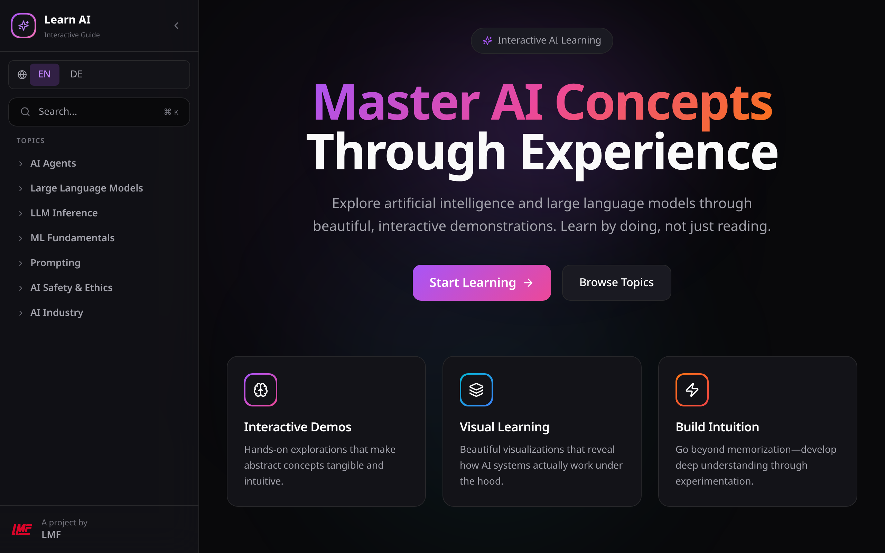
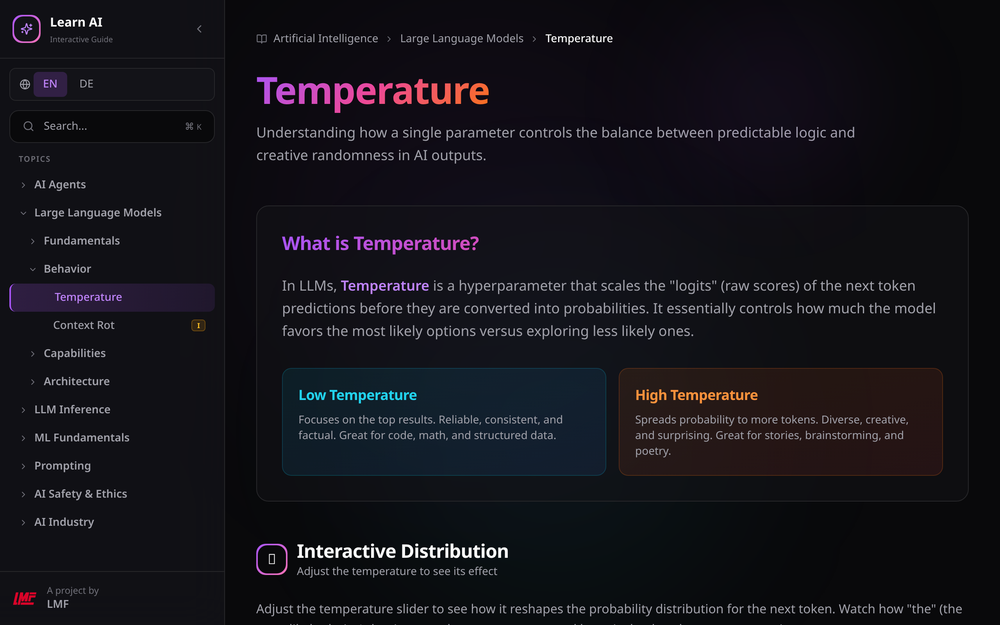
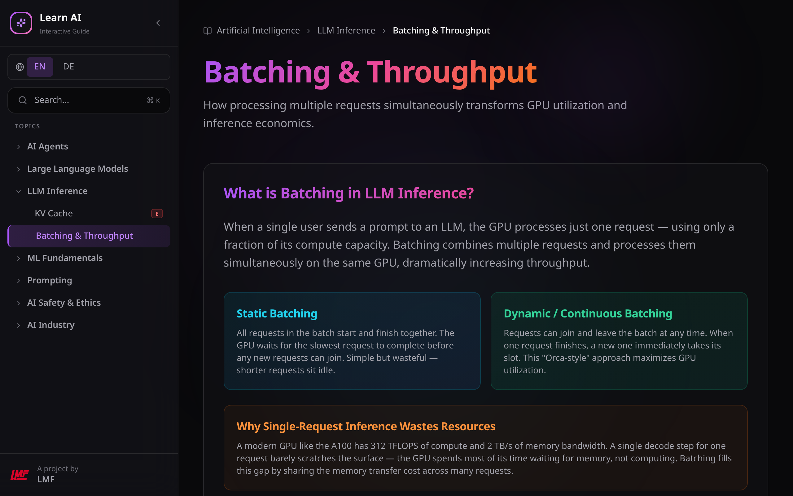
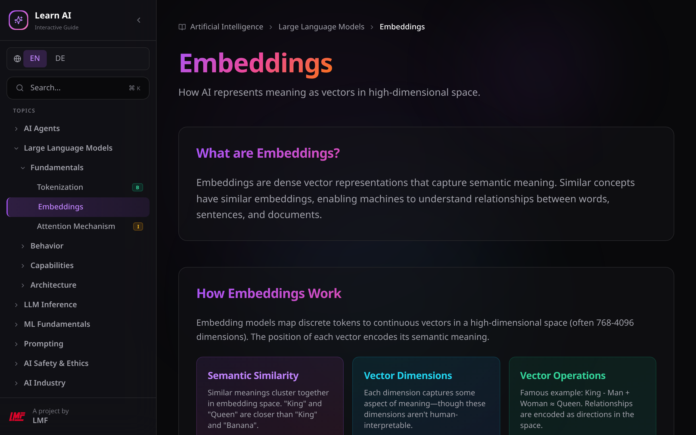

<div align="center">

# Learn AI — Interactive Guide

**Learn by doing, not just reading.**

An open-source interactive learning platform for AI, machine learning, and LLM concepts.
Hands-on visualizations, not walls of text.

[](https://learn.logge.top)
[](LICENSE)
[](https://nextjs.org)
[](https://www.typescriptlang.org)

[**Explore the Guide →**](https://learn.logge.top)

</div>

---



## What is this?

Every topic comes with **interactive demos** you can play with. Adjust temperature sliders, watch token generation in real-time, rotate 3D embedding spaces, simulate batching strategies — the concepts click when you can see them in action.

Available in **English** and **German**.

## Screenshots

<table>
<tr>
<td width="50%">

**Temperature — Control Randomness**



</td>
<td width="50%">

**Batching — GPU Throughput Simulation**



</td>
</tr>
<tr>
<td colspan="2">

**Embeddings — 3D Semantic Space**



</td>
</tr>
</table>

## Topics

| Category | What You'll Learn |
|----------|-------------------|
| **AI Agents** | Agent loops, context management, tool design, memory, orchestration, security |
| **Large Language Models** | Tokenization, embeddings, attention, temperature, RAG, vision, multimodality |
| **LLM Architecture** | Training, Mixture of Experts, quantization, distillation, speculative decoding |
| **LLM Inference** | KV cache, batching & throughput, continuous batching |
| **ML Fundamentals** | Neural networks, gradient descent, training pipelines |
| **Prompting** | Basics, advanced techniques, system prompts |
| **AI Safety** | Bias & fairness, responsible AI |
| **AI Industry** | European AI, open source, model comparisons |

Each topic has a **difficulty rating** (Beginner / Intermediate / Expert) shown in the sidebar.

## Tech Stack

| | |
|---|---|
| **Framework** | [Next.js 14](https://nextjs.org/) (App Router, SSG) |
| **Language** | [TypeScript](https://www.typescriptlang.org/) |
| **Styling** | [Tailwind CSS](https://tailwindcss.com/) |
| **Animations** | [Framer Motion](https://www.framer.com/motion/) |
| **3D** | [React Three Fiber](https://docs.pmnd.rs/react-three-fiber) + [Three.js](https://threejs.org/) |
| **Math** | [KaTeX](https://katex.org/) |
| **Tokenizer** | [js-tiktoken](https://github.com/dqbd/tiktoken) (o200k_base) |
| **Icons** | [Lucide React](https://lucide.dev/) |

## Development

```bash
# Install dependencies
npm ci --legacy-peer-deps

# Start dev server
npm run dev

# Build for production
npm run build
```

## Contributing

Found a bug? Have an idea for a new topic? Want to improve a visualization?

- **Bug reports & suggestions** → [Open an issue](https://github.com/LoggeL/learn-guide/issues)
- **New topics or translations** → PRs welcome!
- **Typos & small fixes** → Just submit a PR

## License

MIT — use it, learn from it, build on it.

---

<div align="center">

A project by [**LMF**](https://lmf.logge.top)

</div>
